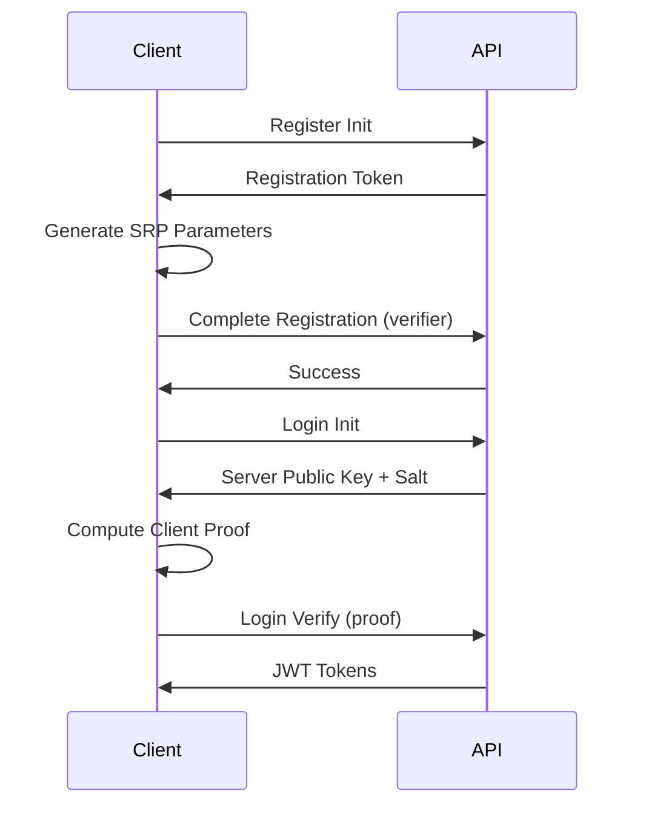

# 🔐 ZeroLock

A zero-knowledge password manager API built with modern security principles. Your passwords never leave your device in plaintext.


## 🌟 Features

- **Zero-Knowledge Architecture**: Implements SRP (Secure Remote Password) protocol - server never sees your passwords
- **JWT Authentication**: Stateless session management with access and refresh tokens
- **Advanced Security**: Account lockout, audit logging, rate limiting, and breach detection
- **Production Ready**: Comprehensive error handling, input validation, and security headers
- **RESTful API**: Clean, documented endpoints for all operations

## 🚀 Live Deployment

- **API Endpoint**: [zerolock-api.kuldeepdev.me](https://zerolock-api.kuldeepdev.me)
- **Documentation**: [zerolock.kuldeepdev.me](https://zerolock.kuldeepdev.me)

## 📚 Quick Start

### Prerequisites

- Node.js >= 18
- PostgreSQL >= 14
- npm or yarn

### Installation

```bash
# Clone the repository
git clone https://github.com/yourusername/zerolock.git
cd zerolock

# Install dependencies
npm install

# Set up environment variables
cp .env.example .env
# Edit .env with your configuration

# Run database migrations
npm run migrate

# Start development server
npm run dev
```

### Environment Variables

```env
PORT=4004
NODE_ENV=development


RATE_LIMIT_WINDOW_MS=900000
RATE_LIMIT_MAX_REQUESTS=100

DATABASE_HOST=db_host   
DATABASE_PORT=port
DATABASE_NAME=db_name
DATABASE_USER=db_user
DATABASE_PASSWORD=db_password
DATABASE_SSL=true
# JWT Configuration
JWT_SECRET=
JWT_EXPIRES_IN=24h
JWT_REFRESH_SECRET=
JWT_REFRESH_EXPIRES_IN=7d
```

## 🔑 Core Concepts

### Zero-Knowledge Authentication (SRP)

ZeroLock uses the Secure Remote Password protocol, which means:

1. **Registration**: Client generates password hash locally, sends only the verifier
2. **Login**: Challenge-response authentication without transmitting passwords
3. **Security**: Server never sees or stores actual passwords

### API Flow



## 📖 API Documentation

Full API documentation is available at [zerolock.kuldeepdev.me](https://zerolock.kuldeepdev.me)

### Key Endpoints

- `POST /api/auth/register/init` - Start registration
- `POST /api/auth/register/complete` - Complete registration with SRP
- `POST /api/auth/login/init` - Initialize login
- `POST /api/auth/login/verify` - Verify and get tokens
- `GET /api/auth/profile` - Get user profile
- `GET /api/security/logs` - View security audit logs

## 🏗️ Architecture

```
zerolock/
├── src/
│   ├── config/         # Configuration
│   ├── controllers/    # Request handlers
│   ├── middleware/     # Express middleware
│   ├── models/         # Database models
│   ├── routes/         # API routes
│   ├── services/       # Business logic
│   └── utils/          # Utilities
├── migrations/         # Database migrations
└── logs/              # Application logs
```

## 🛡️ Security Features

- ✅ SRP Protocol (RFC 5054)
- ✅ JWT with refresh tokens
- ✅ Rate limiting per endpoint
- ✅ Account lockout after failed attempts
- ✅ Comprehensive audit logging
- ✅ Input validation (Zod)
- ✅ SQL injection protection
- ✅ XSS protection
- ✅ Security headers (Helmet.js)
- ✅ CORS configuration

## 🧪 Testing

```bash
# Run all tests
npm test

# Test specific components
node src/testSrp.js      # Test SRP implementation
node src/testJwt.js      # Test JWT functionality
node src/testSecurity.js # Test security features
```


